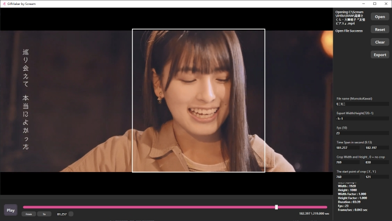

# GifMaker 

  

  
載入影片以後 可以快速擷取片段生成GIF  

## 使用說明
- Open - 開啟影片檔  
- Reset - 重設圈選範圍  
- Clear - 清除所有設定  
- Export - 輸出 
- Play/Pause - 播放/暫停影片
- From - 設定當前時間點 為開始時間點
- To - 設定當前時間點 為結束時間點
- Null - 跳轉到指定時間點

### 快捷鍵
- ESC - 離開文字輸入框
- Z - 上一個Frame
- X - 下一個Frame
- C - 設定當前時間點 為開始時間點
- V - 設定當前時間點 為結束時間點
- Space - 播放/暫停
- Mouse Left Button - 設定圈選範圍
- Mouse Right Button - 重設圈選範圍  

---

#### 備註
- 寬與高的設定若設定-1:-1 表示不做縮放
- 輸出路徑為程式資料夾所在位置  
- Scale值輸出指接受以下兩種Pattern
    - -1:-1
    - w:-1

    
#### Memo
- 縮放的各種問題 
    - 1440X1080 as 1920X1080
    - 其他Pattern的值
- TimeSpan 值確認
- Scale 值確認
- Slider Drag  

`老婆生成器`